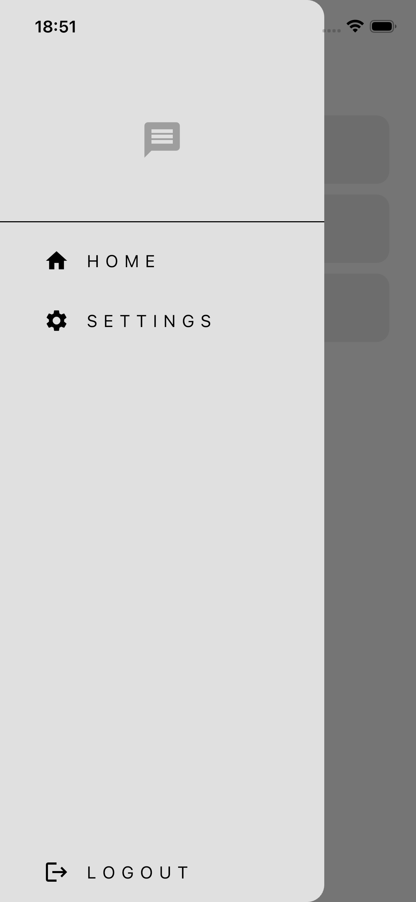
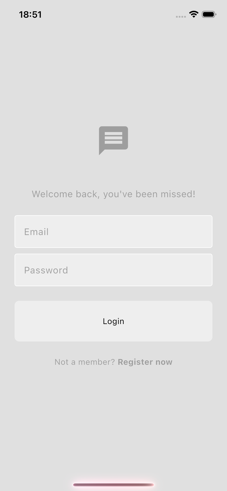

# Realtime Chat App 🚀

A modern, sleek, and high-performance realtime chat application built with **Flutter** and **Firebase**.

## 📸 Screenshots

<p align="center">
  
  
  
</p>

## ✨ Features

- **Real-time Messaging**: Instant message delivery using Firebase Firestore.
- **Firebase Authentication**: Secure email and password login/registration.
- **Dynamic Chat Bubbles**: Styled message bubbles that differentiate between sender and receiver.
- **User List**: Automatically populates with all registered users (excluding current user).
- **Clean UI/UX**: Minimalist and modern design with a focused user experience.
- **Theme Support**: Built-in light mode theme.

## 🛠️ Built With

- [Flutter](https://flutter.dev/) - UI Toolkit
- [Firebase Auth](https://firebase.google.com/docs/auth) - Authentication
- [Cloud Firestore](https://firebase.google.com/docs/firestore) - Real-time Database

## 🚀 Getting Started

### Prerequisites

- Flutter SDK
- Dart SDK
- Firebase Project

### Installation

1. Clone the repository:
   ```bash
   git clone https://github.com/dogualagoz/realtime-chat-app-flutter.git
   ```
2. Navigate to the project directory:
   ```bash
   cd realtime_chat_app
   ```
3. Install dependencies:
   ```bash
   flutter pub get
   ```
4. Connect to your Firebase project:
   - Run `flutterfire configure` to set up your Firebase options.
5. Run the app:
   ```bash
   flutter run
   ```

---

_Developed with ❤️ by Dogu Alagoz_
